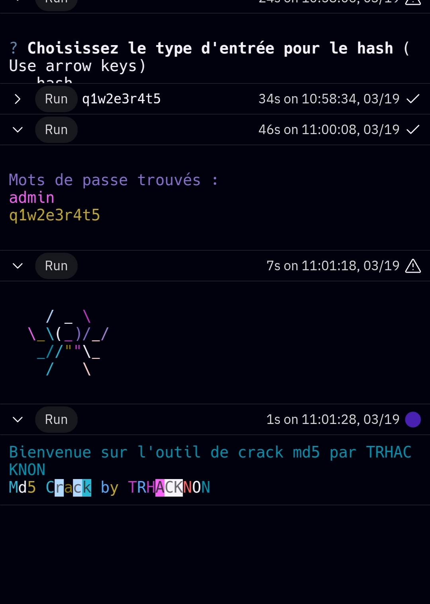

# hashidcrack by 
# :smiling_imp: TRHACKNON :space_invader:
[]
## Introduction
Ce programme Python permet de craquer des hash MD5 en utilisant des techniques de dictionnaire.

## Fonctionnalités
- Craquage de hash MD5 en utilisant un dictionnaire

## Installation
Vous pouvez installer `hashidcrack` en clonant ce dépôt :

```bash
git clone https://github.com/rainbowhatrkn/hashidcrack.git
```

## Utilisation
- Lancez le script `md5.py` et suivez les instructions pour craquer un hash MD5.
- Utilisez l'option  file pour indiquer le fichier texte contenant les hash a cracker , l'option hash unique en indiquant yn seul gash ou hash multiple en indiquant plusieurs hash separes par des virgules .

## Exemple
```bash
python md5.py
```

<details>
<summary>Repl.it</summary>

Vous pouvez également essayer `hashidcrack` en ligne via Repl.it.

## Run on replit

[](http://replit.com/@trkn/hashidcrack)

## Clone on replit

[](https://replit.com/github/rainbowhatrkn/hashidcrack)

</details>

## Contributions
Les contributions sont les bienvenues ! N'hésitez pas à ouvrir une issue ou à soumettre une pull request.

## Licence
Ce projet est sous licence MIT. Consultez le fichier [LICENSE](LICENSE) pour plus de détails.
